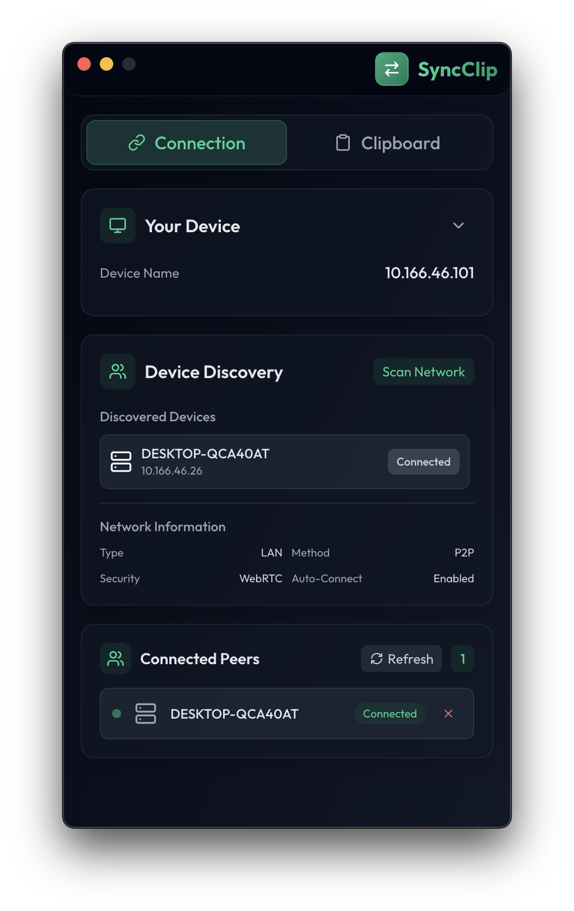
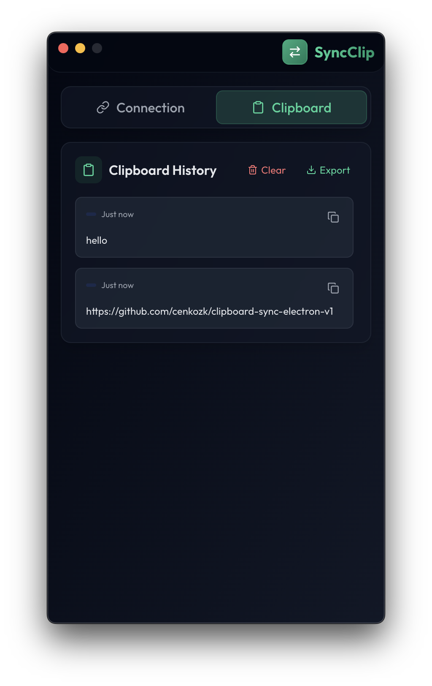

# SyncClip - P2P Clipboard Sync

Because copying and pasting between devices shouldn't be this hard in 2025.

## What's this thing do?

Ever been coding on your laptop, found some perfect Stack Overflow snippet, but needed it on your desktop? Yeah, me too. This little app syncs your clipboard across devices using good old peer-to-peer networking. No cloud nonsense, no privacy concerns, just your devices talking to each other on your local network.



## Just want it to work? Download and run

- **Windows**: Grab `SyncClip.exe` and double-click it
- **macOS**: Download `SyncClip.app`, drag to Applications, probably right-click → Open first time (thanks, Gatekeeper)
- **Linux**: Get `SyncClip.AppImage`, `chmod +x` it, then `./SyncClip.AppImage`

That's it. Seriously.

## The technical stuff (because you're probably curious)

Built this with Electron because I needed it to work everywhere and didn't want to write three separate apps. Uses WebRTC for the actual P2P communication and UDP broadcasts for device discovery. React frontend because, well, it's 2025.

**Stack:**

- Electron + React + TypeScript (the holy trinity)
- Tailwind for styling (fight me)
- WebRTC for peer connections
- UDP broadcasts for "hey, anyone else running this thing?"

## How to use it

1. Run the app on whatever devices you want to sync
2. Hit "Scan Network" - it'll find other instances automatically
3. Click connect on the devices you find
4. Copy something. Watch it magically appear on your other devices.
5. Feel slightly less annoyed at technology



## Developer setup

```bash
git clone <your-repo-url-here>
cd clipboard-sync-electron-v1
npm install
npm run dev
```

Want to build your own executables?

```bash
npm run build:win    # Windows .exe
npm run build:mac    # macOS .dmg
npm run build:linux  # Linux .AppImage
```

## Features that actually matter

- **Cross-platform** - Works on the big three OSes
- **Local network only** - Your data doesn't leave your WiFi
- **System tray integration** - Runs in background, stays out of your way
- **Clipboard history** - See what you copied recently
- **Global shortcut** - Ctrl+Shift+H (or Cmd+Shift+H on Mac) to show/hide
- **Actually works** - Tested with my setup, YMMV

## When stuff breaks (and it probably will)

**Can't find other devices?**

- Your firewall is probably blocking it. Allow the app through.
- Make sure everything's on the same WiFi network
- Try the manual connect option with the IP address

**Clipboard not syncing?**

- Check if the devices actually connected (should show in the UI)
- On macOS, you might need to grant clipboard permissions
- Windows sometimes gets weird - try running as admin once
- When in doubt, restart the app

**Still broken?**

- Check the console for errors (Ctrl+Shift+I / Cmd+Option+I)
- File an issue with actual details, not just "doesn't work"

## Project structure (for the curious)

```
├── app/           # React components and pages
├── main.js        # Electron main process (the important stuff)
├── p2p-network.js # WebRTC and networking logic
├── preload.js     # Bridge between main and renderer
└── assets/        # Icons and stuff
```

## Contributing

Got ideas? Cool. Fork it, make it better, send a PR. Just try to:

- Keep the code readable
- Test your changes on more than just your machine
- Don't break existing functionality (please)

## License

MIT - basically do whatever you want with it. I just ask that you don't blame me if it breaks something important.

---

**P.S. - This only works on your local network. No cloud, no external servers, no tracking. Your paranoid security friend can chill.**
